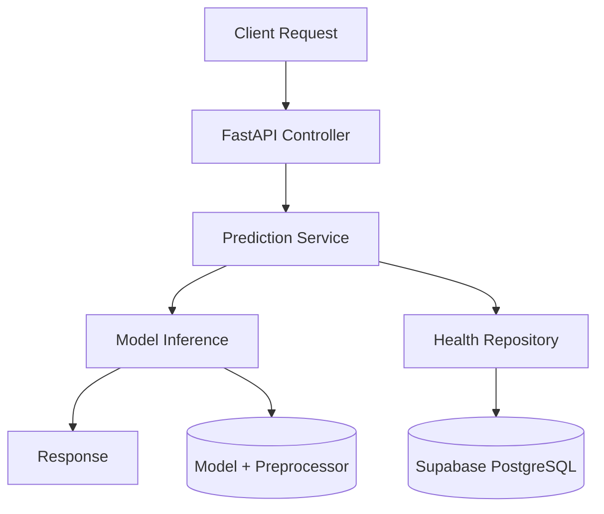
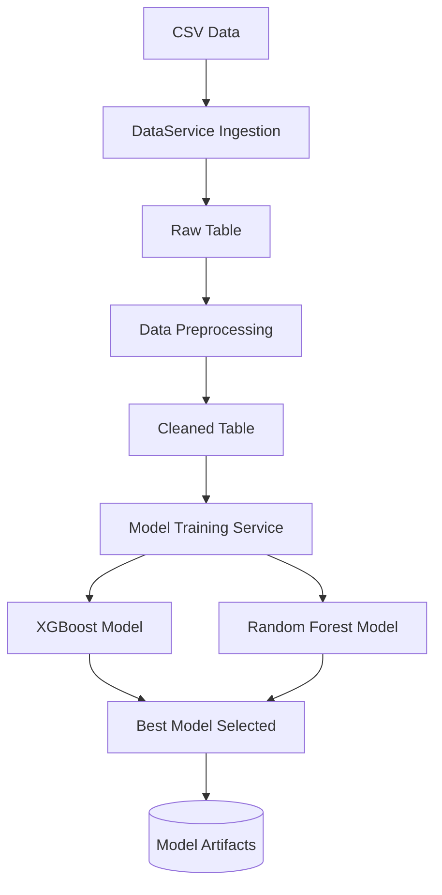

# 🏥 Healthcare ML Pipeline


Production-ready **FastAPI Healthcare ML system** with automated training, Supabase PostgreSQL integration, and deployment support for Render & Docker.

---

## 🚀 One-Click Deployment

### Render
[](https://render.com)

### Vercel (API alternative)
[](https://vercel.com/new)

---

## 📊 System Architecture



---

## 🔄 Data Pipeline Flow



---

## 📁 Repository Structure

```
app/
  controllers/     FastAPI routes
  core/            config, scheduler
  db/              database session
  ml/              preprocessing + inference
  models/          Pydantic + DB models
  repositories/    data access layer
  services/        business logic

migrations/
models/
scripts/
Dockerfile
render.yaml
vercel.json
```

---

## 🧠 Overview

This system:

- Ingests healthcare CSV datasets
- Cleans and validates medical records
- Trains ML models (XGBoost + Random Forest)
- Selects best model using weighted F1-score
- Serves predictions via REST API
- Logs predictions & metrics in Supabase
- Retrains weekly automatically (APS cheduler / cron)

---

## 🏥 Target Prediction Classes

- Normal
- Abnormal
- Inconclusive

---

## ⚙️ API Reference

### 🔮 Predict

`POST /api/v1/predict`

```json
{
  "Age": 45,
  "Gender": "Male",
  "Blood Type": "O+",
  "Medical Condition": "Diabetes",
  "Billing Amount": 2000.5,
  "Admission Type": "Emergency",
  "Insurance Provider": "Cigna",
  "Medication": "Aspirin"
}
```

### Response

```json
{
  "predicted_test_result": "Abnormal",
  "confidence": 0.85,
  "model_version": "xgboost_v1",
  "timestamp": "2026-04-20T10:00:00Z"
}
```

---

## 🧪 Health Checks

- `GET /api/v1/health`
- `GET /api/v1/ready`
- `GET /docs`

---

## 🧾 Database Schema

Tables:

- raw_healthcare_data
- cleaned_healthcare_data
- model_metrics
- prediction_logs
- pipeline_audit

---

## 🤖 Model Training

Models used:

- XGBoost Classifier
- Random Forest Classifier

Selection metric:
- Weighted F1-score

Outputs:
- model.joblib
- preprocessor.joblib
- metrics.json

---

## 🐳 Docker Deployment

```bash
docker build -t healthcare-ml .
docker run -p 10000:10000 healthcare-ml
```

---

## ☁️ Environment Variables

```env
SUPABASE_URL=
SUPABASE_KEY=
DATABASE_URL=
SECRET_KEY=
MODEL_PATH=./models/model.joblib
```

---

## 🔐 Security

- Supabase service key must remain server-side only
- RLS enabled on database
- CORS restricted in production

---

## 📈 Monitoring

- Prediction logs stored in PostgreSQL
- Model performance tracked per training cycle
- API logs include inference + errors

---

## 🛠️ Local Setup

```bash
pip install uv
uv sync

python train_initial_model.py
uvicorn app.main:app --reload
```

---

## 📌 Deployment Flow

1. Push to GitHub
2. Render builds Docker image
3. Database initialized via migrations
4. Model trained on first run
5. API becomes live

---

⭐ If you like this project, consider starring the repository.
